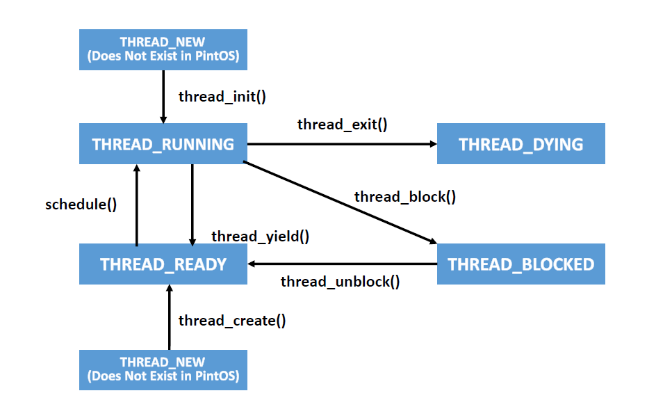

# EC4205 운영체제 프로젝트 과제: PintOS HW1

작성자: 팀1(20185054 김현서, 20195023 김민석)
저장소: [dodok8/GIST_PintOS](https://github.com/dodok8/GIST_PintOS)

## Problem Definition

 PintOS는 프로세스 별로 하나의 쓰레드가 할당되며, 프로세스가 생성됨과 동시에 생겨나 다음 그림과 같은 라이프 사이클을 가지게 된다.

 

 현재 `timer_sleep(int64_t ticks)`의 구현은 `ticks`로 들어오는 시간만큼 지연시키기 위해, 현재 틱과 경과 시간을 비교, `thread_yield()`를 호출한다.

 ```c
void timer_sleep (int64_t ticks)
{
  int64_t start = timer_ticks ();

  ASSERT (intr_get_level () == INTR_ON);
  while (timer_elapsed (start) < ticks) 
    thread_yield ();
}
 ```

그리고 `thread_yield()`에서는 현재 쓰레드가 `idle_thread`가 아니라서 READY로 변환이 가능한 경우, `ready_list`에 해당 쓰레드를 넣고, 쓰레드의 상태를 `THREAD_READY`로 바꾼다.

```c
/* Yields the CPU.  The current thread is not put to sleep and
   may be scheduled again immediately at the scheduler's whim. */
void thread_yield (void) 
{
  struct thread *cur = thread_current ();
  enum intr_level old_level;
  
  ASSERT (!intr_context ());

  old_level = intr_disable ();
  if (cur != idle_thread) 
    list_push_back (&ready_list, &cur->elem);
  cur->status = THREAD_READY;
  schedule ();
  intr_set_level (old_level);
}
```

문제는 이 과정이 매 틱마다 반복되어서 지연 되어야 하는지 체크와 `ready_list`에 넣고, 상태를 `THREAD_READY`로 바꾸고 `schedule()`을 호출해 다시 스케쥴링 하는 과정이 매 틱마다 반복되기 때문에 매우 비효율적이란 것이다. 이렇듯 매 틱마다 체크를 하는 대신에 다른 방식으로 구현하는 것이 이 과제의 목적이다.

## Policy and Algorithm

 위의 문제를 해결하기 위해, 우리는 쓰레드를 `THREAD_BLOCKED` 상태로 바꾼 후, 미리 설정된 tick이 지난 후에 unblock 하여, 그 시점에 `THREAD_READY`로 변경 후 `schedule()`을 호출하는 식으로 진행하기로 하였다.

 1. `timer_sleep()`이 호출될 경우, 쓰레드의 상태를 `THREAD_BLOCKED`로 바꾸고, 이런 쓰레드를 따로 리스트에 저장한다. 그리고 `thread`내에 언제 깨어나야 하는지 정보를 저장한다. `idle_thread`의 경우, 이 쓰레드가 `THREAD_BLOCKED`이 되면 쓰레드에 일을 할당할 수 없게 되므로, 제외한다.

 2. 현재 tick과 쓰레드에 저장된 언제 깨어나야 하는지 저장된 정보와 비교하고, 깨어나야할 시간이면 리스트에서 제거하고, 쓰레드를 `thread_unblock()`하여 `THREAD_READY` 상태로 전환한다.

## Implementation

 위 내용을 구현하기 위해 다음과 같은 순서로 진행하였다.

 1. `THREAD_BLOCKED`된 쓰레드를 저장하기 위해 `sleep_list`를 선언한다.(`thread.c`)

 ```c
 // List of THREAD_BLOCKED processes. 1st PintOS
 static struct list sleep_list;
 ```

 2. `struct thread`에 `THREAD_READY`로 전환되어야 하는 시점을 기록하기 위해 `int64_t sleeptick` 멤버를 추가한다.(`thread.h`)

 ```c
 struct thread
 {
   ...
   int64_t sleeptick;
   ...
 };
 ```

 3. `timer_sleep(int64_t tick)`이 호출될 경우, 현재 쓰레드를 가져오고 `sleeptick`에 언제 `THREAD_BLOCKED`이 풀려야 하는지 저장한다. 그리고 `int_disabler()`을 호출해 인터럽트를 멈춰 `thread_block(void)`에서 `ASSERT`에 걸리지 않도록 한 뒤, `thread_block()`을 호출한 후 다시 인터럽트를 되돌린다.(timer.c)

 ```c
 void timer_sleep(int64_t tick)
 {
   int64_t start = timer_ticks();
   enum intr_level old_level;
 
   ASSERT(intr_get_level() == INTR_ON);
   thread_current()->sleeptick = start + tick;
   old_level = intr_disable();
   thread_block();
   intr_set_level(old_level);
 }
 ```

 4. `thread_block(void)` 에서는 현재 쓰레드를 가져온 뒤, 이 쓰레드가 `idle_thread`가 아니어서 `THREAD_BLOCKED`가 될 수 있으면, 상태를 바꾸고, `sleep_list`에 저장하고, `schedule()`을 호출한다. (thread.c)

 ```c
 void thread_block(void)
 {
   struct thread *cur = thread_current();
   enum intr_level old_level;

   ASSERT(!intr_context());
   ASSERT(intr_get_level() == INTR_OFF);

   old_level = intr_disable();
   if (cur != idle_thread)
   {
     list_push_back(&sleep_list, &thread_current()->elem);
     cur->status = THREAD_BLOCKED;
     schedule();
   }
 }
 ```

 5. 매 틱마다 호출되는 `thread_tick(void)`에 `unblock_proper_thread()`를 호출하도록 한다.  

 ```c
 /* Timer interrupt handler. */
 /* Called by the timer interrupt handler at each timer tick.
    Thus, this function runs in an external interrupt context. */
 void thread_tick(void)
 {
   ... 
   unblock_proper_thread();
   ...
 }
 ```

 6. `unblock_proper_thread()`는 `sleep_list`의 엔트리를 돌아가며, 각 쓰레드의 `sleeptick`과 현재 틱을 비교하여, `TREAD_UNBLOCKED`에서 벗어나야 하면 `thread_unblock(struct thread *t)`을 호출, `TREAD_READY`로 전환한다.

 ```c
 // function to find processes that need to unblock (pintos 1st project)
 void unblock_proper_thread(void)
 {
   if (!list_empty(&sleep_list))
   {
     struct list_elem *tmp_element = list_begin(&sleep_list);
     int64_t cur_tick = timer_ticks();
     while (tmp_element != list_end(&sleep_list))
     {
       struct thread *tmp_thread = list_entry(tmp_element, struct thread, elem);
       if (tmp_thread->sleeptick <= cur_tick)
       {
         struct list_elem *tmp_print = list_begin(&sleep_list);
         while (tmp_print != list_end(&sleep_list))
         {
           tmp_print = list_next(tmp_print);
         }
 
         tmp_element = list_remove(tmp_element);
         tmp_print = list_begin(&sleep_list);
         while (tmp_print != list_end(&sleep_list))
         {
           tmp_print = list_next(tmp_print);
         }
         thread_unblock(tmp_thread);
       }
       else
       {
         tmp_element = list_next(tmp_element);
       }
     }
   }
 }
 ```

## Result

### 과제 전

 

### 과제 후

 