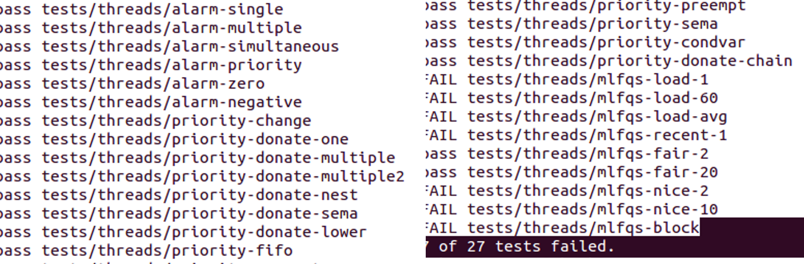

# EC4205 운영체제 프로젝트 과제: PintOS HW2

작성자: 팀1(20185054 김현서, 20195023 김민석)
저장소: [dodok8/GIST_PintOS](https://github.com/dodok8/GIST_PintOS)

## Problem 1

현재의 PintOS는 `ready_list`에 들어 온 것을 순차적으로 실행한다. 이를 더 중요한(더 높은 우선 순위를 가진) 쓰레드부터 실행 될 수 있도록 다음 2가지를 구현한다.

- `ready_list`에서 가장 높은 우선 순위를 가진 쓰레드가 다음에 실행되도록 한다.
- `ready_list`에 추가된 쓰레드가 현재 쓰레드 보다 우선 순위가 높으면, 새 쓰레드가 실행되도록 한다.

### Algorithm

 1. 새로 생긴 thread가 현재 실행중인 thread보다 priority가 높은 경우 switching
 2. 현재 실행중인 thread의 priority가 바뀌었고, 다른 `ready_list`의 thread보다 priority보다 낮아졌을 때 switching

이를 위해, read_list에 추가되는 경우, priority에 따라 높은 우선 순위가 먼저 들어가도록 하였고, `thread_create`와 `thread_set_priority`에서 switching이 필요한 경우, `thread_yield`를 호출하였다.

### Implementation

```c
bool less_pri_comp(struct list_elem *a, struct list_elem *b, void *aux)
{
  struct thread *a_thread = list_entry(a, struct thread, elem);
  struct thread *b_thread = list_entry(b, struct thread, elem);

  if (a_thread->priority > b_thread->priority)
    return true;
  else
    return false;
}
```

먼저 우선 순위를 비교하기 위해 `less_pri_comp`를 만들었다.

```c
void thread_yield(void)
{
  ...
  if (cur != idle_thread)
  {
    list_insert_ordered(&ready_list, &cur->elem, &less_pri_comp, NULL);
  }
  ...
}

```

```c
void thread_unblock(struct thread *t)
{
  ...
  list_insert_ordered(&ready_list, &t->elem, &less_pri_comp, NULL);
  ...
}
```

이렇게 스케쥴링을 위해 `ready_list`에 접근 할 때, 우선 순위에 따라 정렬되게 했으므로, `ready_list`는 항상 정렬된 상태로 있다.

```c
void thread_set_priority(int new_priority)
{
  ASSERT(PRI_MIN <= new_priority && new_priority <= PRI_MAX); // priority로 적합하지 않은 값이 들어올 경우 정지
  ...
  struct thread *next_t = list_entry(list_begin(&ready_list), struct thread, elem);
  ...
  if(t->priority < next_t->priority)
    thread_yield();
}
```

만약 현재 쓰레드의 우선 순위가 변경된 경우, `read_list`의 다른 요소들은 이미 정렬된 상태이므로, 현재 쓰레드와 `ready_list`의 바로 다음 쓰레드를 비교해서 `thread_yield`를 호출하는 것으로 switching을 할 수 있다.

또한 테스트 과정에서 Time Out 문제가 계속 발생 했는데, 이는 qemu에서 기존 PintOS의 `0x8900`에서 종료 시퀀스를 지원하지 않기 때문에 생기는 문제임을 확인하고, 종료 포트에 대한 데이터를 수정해서 정상 종료 되도록 하였다. [참고자료](https://www.google.com/url?q=https://stackoverflow.com/questions/39805784/timeout-in-tests-when-running-pintos&sa=D&source=docs&ust=1649513438087802&usg=AOvVaw2vKN1qP73lsEsgO_pBGFdm)

```c
void
shutdown_power_off (void)
{
  ...
  outw (0xB004, 0x2000);

  /* This is a special power-off sequence supported by Bochs and
     QEMU, but not by physical hardware. */
  for (p = s; *p != '\0'; p++)
    outb (0x8900, *p);
  ...
}
```

## Problem 2

만약 어떤 프로세스가 공유 리소스를 선점하고 있는 경우, 락이 풀리기 전에 그 리소스에 접근 하면 안 된다. 그렇지만 우선 순위가 더 높은 쓰레드가 락이 풀리기 전에 스케쥴링이 되어서 실행이 된 경우, 락이 풀리지 않았기 때문에 공유 리소스에는 접근을 할 수 없다. 이를 해결하기 위해, 더 우선 순위가 높은 쓰레드가 자신의 우선 순위를 넘겨주는(Donating) 을 구현해야 한다. 이러한 Donating은 이미 Donating이 일어난 프로세스에게 또 일어날 수도 있다. 이러한 중복된 Donating도 구현을 해야 한다.

### Algorithm

Donating으로 변경되는 우선 순위 정보와 락에 관한 정보를 변경하기 위해 `thread`를 확장해야 한다. 도네이션이 끝나고 돌아 가야할 기존 priority, 도네이션을 한 요소를 저장하는 리스트, 현재 쓰레드가 기다리는 락, 위 도네이션 리스트에 리스트 엘레멘트를 저장할 때, 기존 `semaphore`의 `waiters`를 바로 쓰면, 리스트 엘레멘트의 포인터가 꼬이므로 이를 방지하기 위한 리스트 엘레먼트가 이렇게 저장할 수 있도록 `thread`를 확장한다.

쓰레드의 우선 순위를 바꿀 때(`thread_set_priority`), 기존 priority를 변경 하도록 하고, 또한 이 때 도네이션 한 요소를 저장하는 리스트가 비어있지 않으면(Donation이 발생했음.) 여기서 가장 큰 priority로 변경하도록 한다. 이렇게 함으로써, sync와 관련된 함수들의 결과가 우선 순위 변경에 반영되도록 하였다.

세마포어와 컨디션 관련 함수들도 작동 구조를 변경했다. 원래 세마포어의 `waiters`는 순차적으로 들어가지만, 이를 우선 순위에 따라서 진행되도록 넣는 것으로 변경하였고, 삭제 시에도 정렬을 해서 우선 순위가 지켜지도록 바꾸었다.

락을 얻는 과정(`void lock_acquire(struct lock *lock)`)도 바뀌었는데, Priority Donation이 일어나는 상황이 경우, holder가 NULL이 아니면 이미 기존에 락을 가져간 쓰레드가 있다는 것이므로, 이 때 priority를 비교하여 진행해야 한다. Donation이 진행되어야 하는 경우(holder보다 현재 쓰레드의 priority가 높은 경우), 다음과 같이 진행된다.

 1. 각 쓰레드의 기다리는 락을 현재 락으로 변경 한다.
 2. holder의 도네이션 리스트에 현재 쓰레드를 우선 순위에 따라 저장한다.
 3. nested한 상황을 해결하기 위해, holder의 락이 있는지 확인하면서 거슬러 올라가며 priority를 업데이트 해준다.
 4. 이때, depth를 제한하기 위해 몇 번 올라 갔는지를 확인하고 최대 8번으로 제한한다.

락을 푸는 과정(`lock_release(struct lock *lock)`)의 경우, 락의 홀더의 도네이션 리스트를 순회하며, 그 락을 기다리고 있는 요소들을 리스트에서 제거하고, 홀더의 우선순위를 릴리즈할 락에서 일어난 도네이션을 제외한 priority로 우선 순위로 변경한 다음, 원래 로직을 진행한다.

### Implementation

위의 알고리즘을 구현하기 위해, `sync.c`에서 주로 작업을 했고, 몇몇 `thread`관련 요소도 작업을 해야했다.

먼저 `struct thread`는 이렇게 확장되었다.

```c
struct thread
  {
    ...
    int real_priority;
    struct list donation_list;
    struct lock *cur_waiting_lock;
    struct list_elem donationelem;
    ...
  };

```

그리고 이렇게 확장된 쓰레드에 맞춰서 `thread_set_priority`가 변경되도록 하였다. 진짜 우선 순위와 우선 순위 둘 다 변경하고, donation이 일어난 상황일 경우, 이에 맞게 우선 순위를 변경하도록 하였다.

```c
void thread_set_priority(int new_priority)
{
  ASSERT(PRI_MIN <= new_priority && new_priority <= PRI_MAX);
  struct thread *t = thread_current();
  t->real_priority = new_priority;
  t->priority = new_priority;
  struct thread *next_t = list_entry(list_begin(&ready_list), struct thread, elem);

  if (!list_empty(&t->donation_list))
  {
    list_sort(&t->donation_list, &less_pri_comp, NULL);
    struct thread *next_donation_t=list_entry(list_front(&t->donation_list), struct thread, donationelem);
    if(t->priority < next_donation_t->priority)
      t->priority=next_donation_t->priority;
  }
  ...
}

```

Semaphore 관련 함수들도 `list_inserted_order`와 `list_sort`를 사용하여 우선 순위를 지키며 `waiters`에 저장되게 하였다.

```c
...
void sema_down(struct semaphore *sema)
{
  ...
  while (sema->value == 0)
  {
    list_insert_ordered(&sema->waiters, &thread_current()->elem, &less_pri_comp, NULL);
    thread_block();
  }
  ...
}
...
void sema_up(struct semaphore *sema)
{
  ...
  if (!list_empty(&sema->waiters))
  {  
    list_sort(&sema->waiters, &less_pri_comp, NULL);
    thread_unblock(list_entry(list_pop_front(&sema->waiters), struct thread, elem));
  }
  sema->value++;
  decide_preemption();
  intr_set_level(old_level);
}
...
```

`decide_preemption`은 `thread_unlock` 에 따라 `ready_list`에 변화가 생겼을 수 있으므로, 이에 priority에 따라 작동하도록 다음과 같은 일을 한다.

```c
// function to compare to decide preemption of next thread by yield (pintos 2nd project)
void decide_preemption()
{
  struct thread *cur_t = thread_current();
  struct thread *next_t = list_entry(list_begin(&ready_list), struct thread, elem);

  if (cur_t->priority < next_t->priority)
  {
    thread_yield();
  }
}
```

`lock`과 관련된 함수도 nested donation과 이에 따른 priority 업데이트를 반영하기 위해 다음과 같이 변경한다.

```c
...
void lock_acquire(struct lock *lock)
{
  ASSERT(lock != NULL);
  ASSERT(!intr_context());
  ASSERT(!lock_held_by_current_thread(lock));

  if(lock->holder!=NULL && (lock->holder->priority < thread_current()->priority))
  {
    // 락의 홀더 존재 여부와 우선 순위를 비교하여, 아래와 같이 donation을 진행한다.
    thread_current()->cur_waiting_lock=lock;
    list_insert_ordered(&lock->holder->donation_list, &thread_current()->donationelem, &less_donation_pri_comp, NULL);
    
    // 도네이션 진행 중, 중첩된 도네이션이 일어났는지 확인하며 거슬러 올라가며 변경한다.
    int nested_num=0;
    struct thread *tmp_t=thread_current();
    struct thread *holder_t;
    while(tmp_t->cur_waiting_lock!=NULL)
    {
      if(nested_num>=8)
        break;
      holder_t=tmp_t->cur_waiting_lock->holder;
      holder_t->priority=tmp_t->priority;
      tmp_t=holder_t;
      nested_num++;
    }
  }


  sema_down (&lock->semaphore);
  thread_current()->cur_waiting_lock=NULL;
  lock->holder = thread_current ();
}

...

void lock_release(struct lock *lock)
{
  ...
  struct thread *release_t=lock->holder;
  struct list_elem *tmp_elem=list_begin(&release_t->donation_list);
  // 도네이션 리스트를 순회하며, 현재 락을 기다리고 있는 요소들을 도네이션 리스트에서 제거한다.
  while(tmp_elem!=list_end(&release_t->donation_list))
  {
    struct thread *tmp_t=list_entry(tmp_elem, struct thread, donationelem);
    if(tmp_t->cur_waiting_lock==lock)
      list_remove(&tmp_t->donationelem);
    tmp_elem=list_next(tmp_elem);
  }

  release_t->priority=release_t->real_priority;
  if(!list_empty(&release_t->donation_list))
  {
    list_sort(&release_t->donation_list, &less_donation_pri_comp, NULL);
    struct thread *next_donation_t=list_entry(list_front(&release_t->donation_list), struct thread, donationelem);
    if(release_t->priority < next_donation_t->priority)
      // 다음 도네이션을 하는 쓰레드의 우선 순위로 변경한다.
      release_t->priority=next_donation_t->priority;
  }
  

  lock->holder = NULL;
  sema_up(&lock->semaphore);
}
```

`less_donation_pri_comp`는 쓰레드의 `donationelem`의 우선 순위를 비교하기 위해 만든 함수이다.

```c
bool less_donation_pri_comp(struct list_elem *a, struct list_elem *b, void *aux)
{
  struct thread *a_thread = list_entry(a, struct thread, donationelem);
  struct thread *b_thread = list_entry(b, struct thread, donationelem);

  if (a_thread->priority > b_thread->priority)
    return true;
  else
    return false;
}
```

# Result

